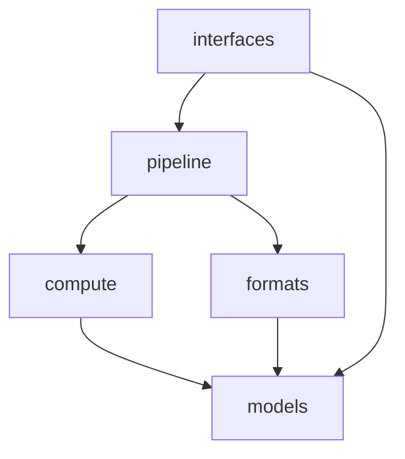

# Architecture Research & Recommendation

## What Was Researched

| Source | Key Takeaway |
|:---|:---|
| **Hexagonal / Ports & Adapters** | Define clean boundaries around the core domain; swap adapters (file formats, devices, UIs) without touching math |
| **Functional Core, Imperative Shell** | All pure math stays side-effect-free; only the outermost shell touches disk, devices, and user |
| **Two-Layer "Cranky/Friendly"** | Compiled core (Rust) is strict and fast; Python shell is user-friendly and flexible |
| **Hail (hail-is/hail)** | Organizes by *domain concept*: `backend/`, `genetics/`, `methods/`, `linalg/`, `stats/`, `fs/`, `vds/` |
| **regenie** | Separates data-reading, modeling logic, and compute engines into distinct modules |
| **scikit-learn** | Enforces separation: data layer → feature layer → modeling layer → orchestration |

## Why Your Current Layout Has Problems

Your instinct is correct. The current `src/g/` layout mixes **organizational axes**:

1. **`io/` vs `output/`** — Both do disk I/O but are separated by *direction* (read vs write). This is an arbitrary split; the PLINK format has both read AND write concerns, so does Arrow.
2. **`plink.py` + `tabular.py`** and **`bgen.py` + `sample.py`** — These are format-pairs split across files with no grouping. A developer looking for "all PLINK logic" has to know to also check `tabular.py`.
3. **`api.py` + `cli.py` at package root** — These are entry points (imperative shell) sitting next to domain logic (`engine.py`, `models.py`). This blurs the boundary between *what the app does* and *how users access it*.

## Recommended Architecture

The architecture that fits this project best is a **domain-layered functional pipeline** — inspired by Hexagonal Architecture but adapted for scientific computing and JAX.

### Organizing Principle

> **Group by domain concept, not by technical concern.**
> Every module should answer: *"What part of the GWAS problem does this solve?"*

### Proposed Structure

```
src/g/
├── __init__.py
├── _core.abi3.so              # Rust FFI extension
├── models.py                  # Core data structures (PyTrees, NamedTuples)
├── jax_setup.py               # JAX device configuration
│
├── compute/                   # Pure math — NO I/O, NO side effects
│   ├── linear.py              #   OLS regression kernels
│   └── logistic.py            #   IRLS + Firth regression kernels
│
├── formats/                   # All file format adapters (read AND write)
│   ├── plink.py               #   .bed/.bim/.fam  (absorbs tabular.py)
│   ├── bgen.py                #   .bgen + .sample  (absorbs sample.py)
│   ├── arrow.py               #   Arrow/Parquet chunks (absorbs output/)
│   └── tsv.py                 #   TSV summary stats output
│
├── pipeline/                  # Orchestration — connects formats → compute → output
│   ├── engine.py              #   Chunk iteration, accumulation, host sync
│   ├── source.py              #   Genotype source resolution & routing
│   └── prefetch.py            #   Async prefetch threading
│
└── interfaces/                # Entry points — how users access the engine
    ├── api.py                 #   Public Python API (`from g import api`)
    └── cli.py                 #   Typer CLI (`g linear ...`)
```

### Why This Structure

| Layer | Rule | Strangler Fig Benefit |
|:---|:---|:---|
| `compute/` | **Pure functions only.** Takes arrays in, returns arrays out. Zero imports from `formats/` or `interfaces/`. | Swap JAX kernels for Triton/CUDA without touching anything else |
| `formats/` | **One module per file format.** Handles both reading AND writing for that format. | Swap Python PLINK reader for Rust FFI reader in `plink.py` alone |
| `pipeline/` | **Orchestration only.** Connects sources → compute → sinks. No math, no parsing. | The "plumbing" that stays stable as internals change |
| `interfaces/` | **Thin shells.** Parse user input, call `pipeline/`, format output. | Add `api_plink.py`, `api_regenie.py` translators here later |
| `models.py` | **Shared vocabulary.** Every layer imports types from here. | Stays stable as the lingua franca between Python and Rust |

### Dependency Flow



> [!IMPORTANT]
> `compute/` must NEVER import from `formats/` or `interfaces/`. This is the single most important rule — it keeps the math testable and replaceable.

## How This Addresses Your Vision

From [VISION.md](file:///home/kirill/Projects/g/docs/VISION.md):
- **Strangler Fig pattern** → `formats/` is the perfect adapter boundary. Replace `formats/plink.py` internals with Rust FFI, everything else stays the same.
- **Dual delivery (Python lib + Rust CLI)** → `interfaces/` cleanly separates entry points. The Rust CLI will eventually bypass `interfaces/` entirely and call `compute/` kernels via FFI.
- **API translators** ([DREAMS_AND_IDEAS.md](file:///home/kirill/Projects/g/docs/DREAMS_AND_IDEAS.md)) → `interfaces/api_plink.py`, `interfaces/api_regenie.py` slot in naturally.
- **Multiple output formats** → `formats/arrow.py`, `formats/tsv.py`, future `formats/parquet.py` all live together.

## What This Is NOT

This is **not** traditional SOLID/OOP. There are no abstract base classes, no deep inheritance hierarchies, no dependency injection containers. It is:
- **Functional** at the core (pure JAX functions)
- **Data-oriented** (NamedTuples and dataclasses, not objects with methods)
- **Hexagonal at the boundary** (clean adapter seams for the Strangler Fig)

## Migration Path

The refactor is purely structural — move files, update imports. No logic changes needed.

1. Create `formats/`, `pipeline/`, `interfaces/` directories
2. Move and merge files (e.g. `tabular.py` → `plink.py`, `sample.py` → `bgen.py`)
3. Move `output/` contents → `formats/arrow.py`
4. Move `api.py`, `cli.py` → `interfaces/`
5. Move `engine.py`, `source.py`, `prefetch.py` → `pipeline/`
6. Update all import paths
7. Run `just check` and `just test`
