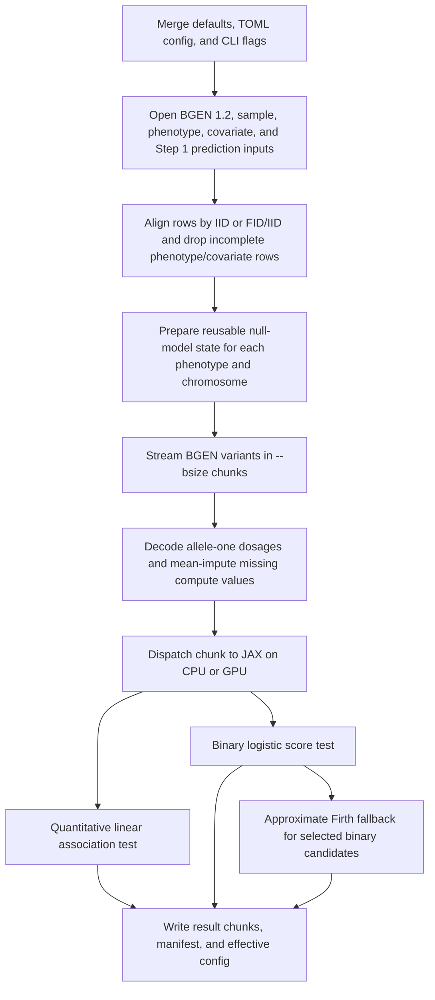

# Algorithm

| Status | Applies to | Owner |
| --- | --- | --- |
| Canonical public algorithm and result-interpretation reference | BGEN-backed REGENIE Step 2 quantitative, binary score, and binary approximate-Firth modes in this checkout | Public interface and compute maintainers |

`g` runs BGEN-backed REGENIE Step 2 association scans. It tests one marker at a
time while using chromosome-specific leave-one-chromosome-out (LOCO)
predictions from REGENIE Step 1 as fixed adjustment terms. It does not fit
REGENIE Step 1; `--pred` must point to a prediction list produced by upstream
`regenie`.[^source-regenie-step2]

The implemented statistical surface is:

| Mode | User options | What is tested |
| --- | --- | --- |
| Quantitative | `--step 2 --qt` | Additive dosage effect in a linear model after covariate and LOCO adjustment. |
| Binary score test | `--step 2 --bt` | Additive dosage effect in a logistic model, evaluated by a score test at the null model. |
| Binary approximate Firth fallback | `--step 2 --bt --firth --approx` | Score test for all variants, then approximate Firth logistic correction for score-test candidates selected by `--pThresh`. |

Recognized REGENIE options outside this surface, such as `--bed`, `--pgen`,
`--spa`, categorical covariates, and exact Firth without `--approx`, fail
clearly instead of being ignored.

Approximate-Firth result labels are current experimental correction diagnostics.
They describe which fallback path produced a row and do not imply exact Firth
support.

## Algorithm Flow

Every run follows that execution shape:

1. Merge defaults, TOML config, and CLI flags into one execution plan.
2. Open the BGEN 1.2 source and resolve sample identifiers from the `.sample`
   file or embedded BGEN samples.
3. Align genotype samples, phenotype rows, covariate rows, and Step 1 LOCO
   predictions using `IID` or `(FID, IID)` according to
   `--sample_key_mode`.
4. Drop rows that are incomplete for the requested phenotype and covariates.
   Require Step 1 LOCO predictions for the remaining aligned samples. Binary
   phenotypes are recoded from REGENIE coding `1 = control`, `2 = case` to
   internal `0/1`.
5. Build reusable null-model state for the aligned samples.
6. Stream BGEN variants in chunks of `--bsize` variants.
7. Decode each chunk to allele-one dosages in `[0, 2]`, mean-impute missing
   genotypes for the compute matrix, and retain observed genotype counts for
   output and numerical statistics.
8. Dispatch the chunk to JAX on `--device cpu` or `--device gpu`.
9. Write Arrow, Parquet, or REGENIE-text result chunks with a run manifest and
   effective config.

Step 2 is conditional on the Step 1 prediction file, the aligned sample set,
covariates, trait mode, and binary correction plan. Changing any of those can
change the statistics, not just the runtime.[^source-regenie-step2]

## Formula Names

The formulas use whole-word variable names. Public output field names such as
`BETA`, `SE`, `CHISQ`, and `LOG10P` stay uppercase because they are output
schema fields, not local mathematical symbols.

| Name in formulas | Meaning |
| --- | --- |
| `sampleCount` | Number of aligned, complete samples for this phenotype or phenotype group. |
| `covariateCount` | Number of covariate columns after adding the intercept. |
| `covariateDesignMatrix` | Complete-case covariate matrix, including the intercept that `g` adds internally. |
| `quantitativePhenotypeVector` | Quantitative phenotype vector for the current complete-case sample set. |
| `binaryPhenotypeVector` | Binary phenotype vector after `1/2` REGENIE coding is recoded to internal `0/1`. |
| `variantDosageVector` | Allele-one expected allele count for one tested variant. |
| `chromosomeLocoPredictionVector` | Quantitative LOCO prediction vector for the tested chromosome. |
| `chromosomeLocoOffsetVector` | Binary LOCO offset vector for the tested chromosome. |
| `covariateProjectionMatrix` | Projection onto the covariate column space. |
| `residualProjectionMatrix` | Projection that removes the covariate column space. |
| `nullProbabilityVector` | Fitted binary null probabilities. |
| `bernoulliVarianceVector` | Per-sample binary variance under the fitted logistic null. |

The public result fields are written as `float32` by default, even when an
internal kernel uses a wider dtype for parity-sensitive work. Set
`[output].output_statistic_dtype = "float64"` when persisted public statistics
must retain float64 precision.

## Quantitative Step 2

For `--qt`, `g` uses a covariate-adjusted linear association test. The model for
one variant on a chromosome is:[^source-quantitative]

$$
\mathrm{quantitativePhenotypeVector}
=
\mathrm{covariateDesignMatrix}\,\mathrm{covariateCoefficientVector}
+
\mathrm{chromosomeLocoPredictionVector}
+
\mathrm{variantDosageVector}\,\mathrm{alleleEffect}
+
\mathrm{errorVector}
$$

The implementation avoids refitting this model from scratch for every variant.
It precomputes the covariate projection once, then reuses it across BGEN
chunks:

$$
\mathrm{covariateProjectionMatrix}
=
\mathrm{covariateDesignMatrix}
\left(
\mathrm{covariateDesignMatrix}^{\mathsf T}
\mathrm{covariateDesignMatrix}
\right)^{-1}
\mathrm{covariateDesignMatrix}^{\mathsf T}
$$

$$
\mathrm{residualProjectionMatrix}
=
\mathrm{identityMatrix}
-
\mathrm{covariateProjectionMatrix}
$$

For each phenotype and chromosome:

$$
\mathrm{phenotypeResidualVector}
=
\mathrm{quantitativePhenotypeVector}
-
\mathrm{covariateProjectionMatrix}\,
\mathrm{quantitativePhenotypeVector}
$$

$$
\mathrm{locoAdjustedPhenotypeVector}
=
\mathrm{phenotypeResidualVector}
-
\mathrm{chromosomeLocoPredictionVector}
$$

$$
\mathrm{analysisResidualVector}
=
\mathrm{residualProjectionMatrix}\,
\mathrm{locoAdjustedPhenotypeVector}
$$

$$
\mathrm{residualMeanSquare}
=
\frac{
\mathrm{analysisResidualVector}^{\mathsf T}
\mathrm{analysisResidualVector}
}{
\mathrm{sampleCount}
-
\mathrm{covariateCount}
}
$$

For each variant:

$$
\mathrm{genotypeResidualVector}
=
\mathrm{residualProjectionMatrix}\,
\mathrm{variantDosageVector}
$$

$$
\mathrm{genotypeResidualSumSquares}
=
\mathrm{genotypeResidualVector}^{\mathsf T}
\mathrm{genotypeResidualVector}
$$

$$
\mathrm{effectNumerator}
=
\mathrm{genotypeResidualVector}^{\mathsf T}
\mathrm{analysisResidualVector}
$$

$$
\mathrm{alleleEffectEstimate}
=
\frac{\mathrm{effectNumerator}}{\mathrm{genotypeResidualSumSquares}}
$$

$$
\mathrm{standardError}
=
\sqrt{
\frac{\mathrm{residualMeanSquare}}{\mathrm{genotypeResidualSumSquares}}
}
$$

$$
\mathrm{chiSquaredStatistic}
=
\frac{
\mathrm{alleleEffectEstimate}^{2}
}{
\mathrm{standardError}^{2}
}
$$

$$
\mathrm{logTenPValue}
=
-
\log_{10}
\left(
\Pr\left[
\chi^{2}_{\mathrm{oneDegreeOfFreedom}}
\ge
\mathrm{chiSquaredStatistic}
\right]
\right)
$$

This is the same one-degree-of-freedom additive association test that can be
viewed as a score, Wald, or single-variant least-squares update after the null
model has been projected out.[^source-score-test]

Numerical safeguards:

- If the allele-one mean dosage is greater than `1`, `g` subtracts `2` from the
  genotype vector before projection. Because the model contains an intercept,
  this constant shift does not change the residualized genotype or statistic;
  it reduces float32 cancellation for high-frequency allele-one variants.
- A variant is marked invalid when residualized genotype variance is not larger
  than `max(--linear_minimum_variance, raw_sum_squares *
  --linear_relative_variance_tolerance)`.
- A phenotype/chromosome state is invalid if the adjusted residual variance is
  not positive.

Changing `--covarCol`, `--covarColList`, `--pred`, `--phenoCol`, sample-key
mode, or multi-phenotype sample mode changes the projection or residual and
therefore can change `BETA`, `SE`, `CHISQ`, and `LOG10P`.

## Binary Score Test

For `--bt`, `g` fits a chromosome-specific logistic null model with the LOCO
offset fixed:[^source-binary]

$$
\mathrm{linearPredictor}_{\mathrm{sample}}
=
\mathrm{covariateRow}_{\mathrm{sample}}\,
\mathrm{nullCoefficientVector}
+
\mathrm{chromosomeLocoOffset}_{\mathrm{sample}}
$$

$$
\mathrm{nullProbability}_{\mathrm{sample}}
=
\operatorname{logistic}
\left(
\mathrm{linearPredictor}_{\mathrm{sample}}
\right)
$$

$$
\mathrm{binaryPhenotype}_{\mathrm{sample}}
\sim
\operatorname{Bernoulli}
\left(
\mathrm{nullProbability}_{\mathrm{sample}}
\right)
$$

The null coefficients are estimated by iteratively reweighted least squares
(IRLS). The maximum iteration count and coefficient tolerance are controlled by
`--binary_null_maximum_iterations` and
`--binary_null_coefficient_tolerance`.

After the null model is fitted:

$$
\mathrm{scoreResidualVector}
=
\mathrm{binaryPhenotypeVector}
-
\mathrm{nullProbabilityVector}
$$

$$
\mathrm{bernoulliVariance}_{\mathrm{sample}}
=
\operatorname{max}
\left(
\mathrm{nullProbability}_{\mathrm{sample}}
\left(1 - \mathrm{nullProbability}_{\mathrm{sample}}\right),
\mathrm{minimumVarianceFloor}
\right)
$$

For each variant, `g` computes a weighted genotype residual variance without
materializing a full residualized matrix:

$$
\mathrm{weightedCovariateMatrix}
=
\operatorname{diagonal}
\left(
\sqrt{\mathrm{bernoulliVarianceVector}}
\right)
\mathrm{covariateDesignMatrix}
$$

$$
\mathrm{weightedVariantDosageVector}
=
\sqrt{\mathrm{bernoulliVarianceVector}}
\odot
\mathrm{variantDosageVector}
$$

$$
\mathrm{weightedCovariateProjectionMatrix}
=
\mathrm{weightedCovariateMatrix}
\left(
\mathrm{weightedCovariateMatrix}^{\mathsf T}
\mathrm{weightedCovariateMatrix}
\right)^{-1}
\mathrm{weightedCovariateMatrix}^{\mathsf T}
$$

$$
\mathrm{weightedGenotypeResidualVector}
=
\mathrm{weightedVariantDosageVector}
-
\mathrm{weightedCovariateProjectionMatrix}\,
\mathrm{weightedVariantDosageVector}
$$

$$
\mathrm{scoreNumerator}
=
\mathrm{variantDosageVector}^{\mathsf T}
\mathrm{scoreResidualVector}
$$

$$
\mathrm{scoreInformation}
=
\mathrm{weightedGenotypeResidualVector}^{\mathsf T}
\mathrm{weightedGenotypeResidualVector}
$$

$$
\mathrm{scoreEffectEstimate}
=
\frac{\mathrm{scoreNumerator}}{\mathrm{scoreInformation}}
$$

$$
\mathrm{scoreStandardError}
=
\sqrt{\frac{1}{\mathrm{scoreInformation}}}
$$

$$
\mathrm{scoreChiSquaredStatistic}
=
\frac{\mathrm{scoreNumerator}^{2}}{\mathrm{scoreInformation}}
$$

$$
\mathrm{logTenPValue}
=
-
\log_{10}
\left(
\Pr\left[
\chi^{2}_{\mathrm{oneDegreeOfFreedom}}
\ge
\mathrm{scoreChiSquaredStatistic}
\right]
\right)
$$

Here `BETA` is the score-test effect estimate for allele-one dosage under the
null model. It is not a full per-variant logistic maximum-likelihood fit unless
the approximate Firth fallback replaces that row.[^source-binary]

Numerical safeguards:

- Fitted probabilities are clipped by `--binary_minimum_probability`.
- Binary variance and information matrices use `--binary_minimum_variance`
  as an absolute floor.
- The score statistic is invalid when `scoreInformation` is not larger than
  `max(--binary_minimum_variance, weighted_sum_squares *
  --binary_relative_variance_tolerance)`.
- By default, `--null_logistic_nonconvergence_policy fail` aborts when a
  chromosome's null logistic model does not converge. With `warn`, the run
  continues, but nonconverged chromosome/trait rows fail the statistic mask.
- High-frequency allele-one variants may be tested internally after flipping
  genotype coding to keep rare carriers near zero; successful `BETA` values are
  restored to the public `ALLELE1` orientation.

## Binary Approximate Firth Fallback

For `--bt --firth --approx`, all variants first receive the binary score test.
Then `g` selects Firth candidates with:[^source-firth]

$$
\mathrm{scorePValue}
<
\mathrm{pThreshold}
$$

Equivalently, because output stores the negative base-ten logarithm of the
p-value, candidates satisfy:

$$
\mathrm{logTenPValue}
>
-
\log_{10}
\left(
\mathrm{pThreshold}
\right)
$$

Lowering `--pThresh` reduces the number of Firth candidates and makes the run
closer to score-only behavior. Raising it sends more variants into the slower
correction path and can change more binary rows.

Firth correction uses the bias-reduced logistic objective:

$$
\mathrm{penalizedLogLikelihood}
\left(
\mathrm{coefficientVector}
\right)
=
\mathrm{logisticLogLikelihood}
\left(
\mathrm{coefficientVector}
\right)
+
\frac{1}{2}
\log
\left|
\mathrm{informationMatrix}
\left(
\mathrm{coefficientVector}
\right)
\right|
$$

The determinant penalty is the Jeffreys-prior penalty used by Firth's
bias-reduction method. It is useful for rare variants, unbalanced case-control
traits, and separation-prone binary models.[^source-firth]

`g` implements the REGENIE-style approximate Firth fallback path:

1. Fit or prepare a covariate-only Firth null model for the chromosome.
2. For candidate variants, recode high-frequency variants if needed and restore
   public allele-one sign after correction.
3. Try the scalar pseudo-Firth approximation and sparse-carrier compaction paths
   when applicable.
4. Fall back through Newton-Raphson zero-start and warm-start attempts according
   to the configured iteration and line-search limits.
5. Use the penalized likelihood-ratio statistic for the corrected row.

Successful corrected rows are labeled
`CORRECTION_METHOD = firth_approximate` and
`CORRECTION_STATUS = success`. Failed approximate-Firth candidates are labeled
`CORRECTION_METHOD = firth_approximate`,
`CORRECTION_STATUS = failed`, and `EXTRA = TEST_FAIL`.

The scalar approximate path uses a one-parameter Firth model after genotype
residualization:

$$
\mathrm{firthLinearPredictor}_{\mathrm{sample}}
\left(
\mathrm{alleleEffect}
\right)
=
\mathrm{nullFirthOffset}_{\mathrm{sample}}
+
\mathrm{alleleEffect}\,
\mathrm{residualizedVariantDosage}_{\mathrm{sample}}
$$

The corrected likelihood-ratio statistic is:

$$
\mathrm{likelihoodRatioChiSquaredStatistic}
=
\operatorname{max}
\left(
2
\left(
\mathrm{fullPenalizedLogLikelihood}
-
\mathrm{nullPenalizedLogLikelihood}
\right),
0
\right)
$$

$$
\mathrm{logTenPValue}
=
-
\log_{10}
\left(
\Pr\left[
\chi^{2}_{\mathrm{oneDegreeOfFreedom}}
\ge
\mathrm{likelihoodRatioChiSquaredStatistic}
\right]
\right)
$$

`--firth-se` changes only the reported `SE` for successful Firth rows. When it
is enabled, `g` reports:

$$
\mathrm{reportedStandardError}
=
\frac{
\left|
\mathrm{alleleEffectEstimate}
\right|
}{
\sqrt{\mathrm{likelihoodRatioChiSquaredStatistic}}
}
$$

for corrected rows with positive `CHISQ`. This ties the standard error to the
likelihood-ratio statistic. It does not change candidate selection, the Firth
fit, `BETA`, `CHISQ`, or `LOG10P`.[^source-firth-se]

Firth-specific tuning options such as `--firth_batch_size`,
`--firth_candidate_capacity`, `--firth_maximum_iterations`,
`--firth_gradient_tolerance`, `--firth_coefficient_tolerance`,
`--firth_likelihood_tolerance`, line-search limits, and sparse-carrier
thresholds should normally stay at their defaults. They affect performance,
convergence, or numerical acceptance of candidate rows, not the intended
scientific model.

## Genotype Handling

`g` reads BGEN 1.2 genotype probability records and converts them to allele-one
dosage. For unphased diploid biallelic records:

$$
\mathrm{alleleOneDosage}
=
\mathrm{heterozygousProbability}
+
2\,
\mathrm{homozygousAlleleOneProbability}
$$

For trusted unphased 8-bit BGEN records, the packed probability-pair path uses:

$$
\mathrm{alleleOneDosage}
=
\frac{
510
-
2\,\mathrm{homozygousReferenceByte}
-
\mathrm{heterozygousByte}
}{
255
}
$$

The `510` and `255` constants come from BGEN Layout 2 probability storage with
8 bits per stored probability: a stored byte represents
`storedByte / (2^8 - 1)`, and the homozygous allele-one probability is inferred
as the unstored last genotype probability.[^source-bgen]

Missing genotype dosages are represented as `NaN` during decode. Before the
statistical kernel runs, each missing dosage is replaced by that variant's
observed mean dosage among aligned samples:

$$
\mathrm{observedMeanDosage}
=
\frac{
\sum_{\mathrm{observedSample}}
\mathrm{alleleOneDosage}_{\mathrm{observedSample}}
}{
\mathrm{observedGenotypeCount}
}
$$

$$
\mathrm{computeDosage}_{\mathrm{sample}}
=
\begin{cases}
\mathrm{observedMeanDosage}, & \mathrm{ifMissingDosage} \\
\mathrm{alleleOneDosage}_{\mathrm{sample}}, & \mathrm{otherwise}
\end{cases}
$$

The output `N`, `A1FREQ`, and `INFO` are based on observed genotype calls:

| Field | Meaning |
| --- | --- |
| `N` | Observed genotype count for the variant after sample alignment. |
| `A1FREQ` | Observed mean allele-one dosage divided by `2`. |
| `INFO` | Observed dosage variance divided by the expected Hardy-Weinberg dosage variance, clamped to `[0, 1]`; missing calls are not counted in the expected denominator. |

The INFO calculation is:

$$
\mathrm{observedAlleleOneFrequency}
=
\frac{\mathrm{observedMeanDosage}}{2}
$$

$$
\mathrm{hardyWeinbergExpectedVariance}
=
2\,
\mathrm{observedAlleleOneFrequency}
\left(
1 - \mathrm{observedAlleleOneFrequency}
\right)
$$

$$
\mathrm{infoScore}
=
\operatorname{clamp}
\left(
\frac{
\mathrm{observedDosageVariance}
}{
\mathrm{hardyWeinbergExpectedVariance}
},
0,
1
\right)
$$

The trusted fast path controlled by `--trusted_no_missing_diploid` assumes the
BGEN records are diploid, unphased, no-missing records that match the optimized
decoder's constraints. `--trusted_bgen_validation_mode` controls whether that
assumption is validated on cache miss, always validated, or assumed by the user.

## Multi-Phenotype Behavior

Multiple phenotypes can be requested with repeated `--phenoCol` flags or
`--phenoColList`.

`--multi_phenotype_sample_mode per-phenotype` is the default. Each phenotype
keeps its own complete-case sample set. `g` may group phenotypes that happen to
share compatible aligned samples, but the statistical semantics match separate
single-phenotype runs. Grouped or union BGEN delivery is an execution
optimization only; each phenotype manifest still records that phenotype's own
sample count and sample-set fingerprint.

`--multi_phenotype_sample_mode complete-case` builds one shared complete-case
intersection across all requested phenotypes. This can reuse genotype decode and
device transfer work across traits, but it is not equivalent to per-phenotype
analysis when missingness differs across phenotypes. It changes `sampleCount`,
the covariate projection, LOCO alignment, and all downstream statistics.
Complete-case manifests record the shared sample-set fingerprint for every
phenotype output in the run.

## Parameter Effects

Statistical parameters:

| Option | Changes statistics? | Effect |
| --- | --- | --- |
| `--qt` / `--bt` | Yes | Selects linear quantitative or logistic binary model. |
| `--phenoCol`, `--phenoColList` | Yes | Selects the trait vector or trait matrix. |
| `--covarCol`, `--covarColList` | Yes | Changes `covariateDesignMatrix`, residualization, degrees of freedom, and null model fits. |
| `--pred` | Yes | Supplies chromosome-specific LOCO predictions or offsets. Different Step 1 models produce different Step 2 adjustments. |
| `--sample`, `--sample_key_mode` | Yes | Changes sample identity resolution and row alignment. |
| `--multi_phenotype_sample_mode` | Yes | Controls whether phenotypes keep independent complete-case samples or share one intersection. |
| `--firth --approx` | Yes, for binary | Replaces selected score-test rows with approximate Firth-corrected rows. |
| `--pThresh` | Yes, for binary Firth | Sets the score-test p-value threshold for Firth candidates. |
| `--firth-se` | Yes, for reported `SE` only | Recomputes successful Firth `SE` as `abs(BETA) / sqrt(CHISQ)`. |
| `--score_dtype` | Can | Changes score-test compute precision. Persisted public statistic precision is controlled separately by `--output_statistic_dtype`. |

Numerical policy parameters:

| Option | Effect |
| --- | --- |
| `--linear_minimum_variance`, `--linear_relative_variance_tolerance` | Decide when a residualized quantitative genotype is too close to zero variance to test safely. |
| `--binary_minimum_probability` | Clips binary fitted probabilities away from exact `0` and `1`. |
| `--binary_minimum_variance`, `--binary_relative_variance_tolerance` | Stabilize binary score variances and information matrices. |
| `--binary_null_maximum_iterations`, `--binary_null_coefficient_tolerance` | Control binary null logistic IRLS termination. |
| `--null_logistic_nonconvergence_policy` | Chooses whether nonconverged binary null fits abort the run or warn and continue with invalid statistic rows. |
| `--firth_*`, `--null_firth_*` | Control approximate-Firth iteration limits, tolerances, line search, step halving, and sparse-carrier behavior. |

Runtime and output parameters:

| Option | Changes statistics? | Effect |
| --- | --- | --- |
| `--bsize` | No intended change | Number of variants decoded and dispatched per chunk. It affects memory, compile shape, and throughput. |
| `--threads` | No intended change | Requested native CPU thread count for Rust-owned work. |
| `--device` | No intended change | Selects JAX CPU or GPU execution. |
| `--staging_depth` | No intended change | Controls how far native chunk delivery can stage callback work. |
| `--bgen_decode_tile_variant_count` | No intended change | Native BGEN decode tile size. |
| `--gpu_genotype_format` | No intended change | Selects dosage transfer, packed8 transfer/decode, or `auto`; `auto` uses packed8 only for eligible single-trait binary GPU runs after trusted BGEN validation. |
| `--format` | No | Chooses Arrow, Parquet, or REGENIE-text materialization. |
| `--resume`, `--resume_mode` | No | Reuses previously committed chunks when the manifest accepts the execution plan. |
| `--telemetry`, `--log_*`, `--trace_*` | No | Controls diagnostics and logging. Profile and trace modes can add synchronization overhead. |

Runtime parameters should not be used to change scientific conclusions. If a
runtime-only parameter changes results beyond normal floating-point tolerance,
treat it as a bug or a reproducibility finding.

## Reading Output Rows

`g` writes REGENIE Step 2-style additive test rows:

| Field | Interpretation |
| --- | --- |
| `CHROM`, `GENPOS`, `ID` | Variant identity from BGEN metadata. |
| `ALLELE0`, `ALLELE1` | Reported alleles. Effects are for `ALLELE1` dosage. |
| `A1FREQ` | Observed allele-one frequency after sample alignment. |
| `INFO` | Observed dosage INFO score as described above. |
| `N` | Observed genotype count after sample alignment. |
| `TEST` | Currently `ADD` for the additive dosage test. |
| `BETA` | Additive allele-one effect estimate for the selected mode. |
| `SE` | Standard error for the reported effect estimate. |
| `CHISQ` | One-degree-of-freedom chi-squared statistic. |
| `LOG10P` | Negative base-ten logarithm of the chi-squared tail probability. Larger means stronger evidence. |
| `EXTRA` | Null/`NA` for ordinary successful rows; `TEST_FAIL` when the statistic or correction failed. |
| `CORRECTION_METHOD` | Diagnostic method label: `score`, `firth_approximate`, or `spa`. |
| `CORRECTION_STATUS` | Diagnostic status label: `success` or `failed`. |

`EXTRA` stays sparse for REGENIE-compatible parsing. Use
`CORRECTION_METHOD` and `CORRECTION_STATUS` to distinguish score-only rows,
successful approximate-Firth rows, SPA-corrected rows when present, and failed
approximate-Firth candidates.

## What to Expect Operationally

- The first chunk shape for a mode may trigger JAX compilation. CPU and GPU
  runs can therefore have a warmup cost before steady-state throughput.
- GPU acceleration depends on enough work per transfer. Single-trait scans can
  be limited by BGEN decode, host-device transfer, or output writing.
- Increasing `--bsize` usually reduces per-chunk overhead but raises memory use
  and can change JAX compile shapes.
- Approximate Firth is intentionally slower than score-only binary testing
  because candidate variants require iterative correction.
- Resume checks compare the manifest against execution-plan-affecting inputs
  and settings. Use `--resume_mode strict` when restart correctness matters
  more than startup speed.
- Result p-values are not multiple-testing corrected. Genome-wide significance
  thresholds and downstream quality control remain the user's responsibility.

## References

[^source-regenie-step2]: Exact source places: the official REGENIE docs,
    [Overview](https://rgcgithub.github.io/regenie/overview/), section
    "Step 2 : Single-variant association testing" and subsections
    "Quantitative traits" and "Binary traits"; Mbatchou et al.,
    [Nature Genetics 2021](https://www.nature.com/articles/s41588-021-00870-7),
    Extended Data Fig. 1 caption text beginning "REGENIE consists of two
    steps". Implementation entry points: `src/g/execution_plan.py`,
    `src/g/io/source.py`, and the `compute_regenie2_*` functions under
    `src/g/compute/`.

[^source-quantitative]: Exact source places: REGENIE docs
    [Overview](https://rgcgithub.github.io/regenie/overview/), section
    "Step 2 : Single-variant association testing" -> "Quantitative traits",
    especially the bullets saying covariates are regressed out, LOCO
    predictions are removed, and linear regression tests the residualized
    phenotype and marker. Implementation place:
    `src/g/compute/regenie2_linear/api.py::compute_regenie2_linear_chunk` and
    `src/g/compute/regenie2_linear/score.py`.

[^source-score-test]: Exact source places: Rao (1948),
    [Large sample tests of statistical hypotheses concerning several parameters
    with applications to problems of estimation](https://doi.org/10.1017/s0305004100023987),
    section 3, "Derivation of statistics for simple and composite hypotheses",
    formula (3.4), for the efficient-score chi-squared statistic; the
    one-degree-of-freedom tail probability is also the statistic form reported
    in Mbatchou et al.,
    [Nature Genetics 2021](https://www.nature.com/articles/s41588-021-00870-7),
    Extended Data Fig. 2 and 3 captions.

[^source-binary]: Exact source places: REGENIE docs
    [Overview](https://rgcgithub.github.io/regenie/overview/), section
    "Step 2 : Single-variant association testing" -> "Binary traits", where the
    logistic score test, LOCO offset, and covariate linear predictor are
    described. Implementation places:
    `src/g/compute/regenie2_binary/state.py`,
    `src/g/compute/regenie2_binary/score.py`, and
    `src/g/compute/regenie2_binary/api.py`.

[^source-firth]: Exact source places: REGENIE docs
    [Overview](https://rgcgithub.github.io/regenie/overview/), section
    "Step 2 : Single-variant association testing" -> "Firth logistic
    regression", for the penalty term, score-test threshold, approximate Firth
    correction, and LRT p-value behavior; REGENIE docs
    [Options](https://rgcgithub.github.io/regenie/options/), rows `--firth`,
    `--approx`, and `--pThresh`; Firth (1993),
    [Bias reduction of maximum likelihood estimates](https://doi.org/10.1093/biomet/80.1.27),
    abstract sentences describing modified score functions and Jeffreys
    invariant prior penalization. Implementation places:
    `src/g/compute/regenie2_binary/correction.py`,
    `src/g/compute/regenie2_binary/firth/null.py`, and
    `src/g/compute/regenie2_binary/firth/scalar_approx.py`.

[^source-firth-se]: Exact source places: REGENIE docs
    [Overview](https://rgcgithub.github.io/regenie/overview/), section
    "Firth logistic regression", sentence describing the `--firth-se` option;
    REGENIE docs [Options](https://rgcgithub.github.io/regenie/options/), row
    `--firth-se`. The likelihood-ratio chi-squared calibration follows Wilks
    (1938),
    [The large-sample distribution of the likelihood ratio for testing
    composite hypotheses](https://doi.org/10.1214/aoms/1177732360).
    Implementation place: `src/g/compute/regenie2_binary/correction.py`.

[^source-bgen]: Exact source places: the BGEN Working Group
    [BGEN v1.2 specification](https://www.chg.ox.ac.uk/~gav/bgen_format/spec/v1.2.html),
    sections "Genotype data block (Layout 2)", "Probability data storage",
    "Per-sample order of stored probabilities", and "Representation of
    probabilities". Implementation places: `crates/genotype/src/bgen/decode/mod.rs` for
    decoding and `crates/genotype/src/preprocess.rs` for missing-value imputation,
    observed genotype counts, allele frequency, and INFO.
