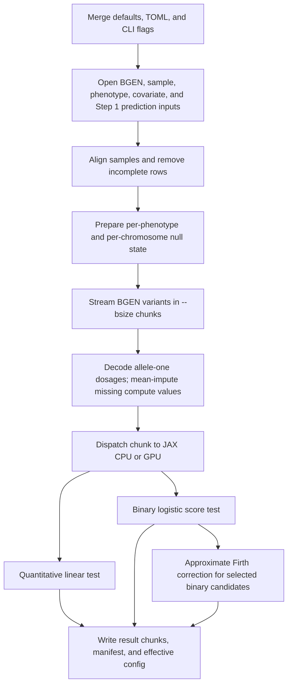

# Algorithm

| Status | Applies to | Owner |
| --- | --- | --- |
| Pre-release draft; public algorithm and result-interpretation reference | main branch as of 2026-07-01 BGEN-backed Step 2 modes | Public interface and compute maintainers |

`g` runs REGENIE-compatible Step 2 single-variant association tests on BGEN input. It does **not** run REGENIE Step 1. Step 2 needs the chromosome-specific leave-one-chromosome-out prediction file produced by Step 1; pass that file with `--pred`.[^regenie-step2]

At a high level, `g` tests one variant at a time:

1. align genotype samples, phenotypes, covariates, and Step 1 LOCO predictions;
2. remove incomplete phenotype/covariate rows;
3. build a reusable null model for each phenotype and chromosome;
4. stream BGEN variants in chunks;
5. compute additive allele-one association statistics;
6. write chunked output plus a manifest that describes the run.

Supported statistical modes:

| Mode | User options | What the row means |
| --- | --- | --- |
| Quantitative | `--qt` | Linear additive effect of `ALLELE1` dosage after covariate and LOCO adjustment. |
| Binary score | `--bt` | Logistic score test for additive `ALLELE1` dosage at the null model. |
| Binary approximate Firth | `--bt --binary-fallback firth_approximate` | Score test for all variants, then approximate Firth correction for variants passing `--pThresh`. |

Unsupported REGENIE behavior should fail clearly. For example, `--bed`, `--pgen`, categorical covariates, `--spa`, and exact Firth are not silently ignored.

> Approximate Firth labels are correction diagnostics. They do not imply exact Firth support.

## Notation used on this page

The main text uses words for data and conventional symbols for scalar statistics.

| Term | Meaning |
| --- | --- |
| `Samples` | Aligned, complete-case samples used for the current phenotype or phenotype group. |
| `Trait` | Quantitative phenotype vector, or binary phenotype vector after REGENIE `1/2` coding is recoded to internal `0/1`. |
| `Covariates` | Complete-case covariate matrix, including the intercept that `g` adds internally. |
| `LOCO` | Chromosome-specific Step 1 prediction. For binary traits this is used as a logistic offset. |
| `Genotype` | Allele-one dosage vector for one variant, with values in `[0, 2]`. |
| `Residualize(value)` | Remove the part of `value` explained by `Covariates`. |
| `WeightedResidualize(value, weights)` | Remove weighted covariate effects under the binary null model. |
| `β` | Reported additive allele-one effect estimate. |
| `SE` | Reported standard error. |
| `χ²` | One-degree-of-freedom chi-squared statistic. |
| `p` | Chi-squared tail probability. |
| `LOG10P` | `-log10(p)`. Larger values mean stronger evidence. |

Public output columns remain uppercase (`BETA`, `SE`, `CHISQ`, `LOG10P`) because those are schema fields.

## Execution flow



Changing the phenotype, covariates, Step 1 predictions, sample file,
multi-phenotype sample mode, trait type, or binary correction plan changes the
statistical analysis, not just runtime behavior.[^regenie-step2]

## Sample and input alignment

For each requested phenotype, `g` builds the analysis sample set by matching rows across:

- the required Oxford `.sample` file paired with the BGEN rows;
- phenotype table;
- optional covariate table;
- Step 1 LOCO predictions.

Matching always uses non-empty, unique `(FID, IID)` pairs; there is no public
IID-only mode. Rows with missing selected phenotype or covariate values are
excluded for that phenotype. Binary phenotypes use REGENIE coding in the input
file (`1 = control`, `2 = case`) and are recoded internally to `0/1`.

This sample set is part of the scientific analysis. Changing it changes `N`, covariate adjustment, LOCO alignment, and all downstream statistics.

## Quantitative Step 2

For `--qt`, the intended model for one variant is:

```text
Trait = Covariates × covariate effects
      + LOCO
      + Genotype × β
      + error
```

`g` avoids refitting this full model for every variant. Instead, it removes covariate effects once, then reuses the result across BGEN chunks.[^quantitative]

For each phenotype and chromosome:

```text
AdjustedTrait = Trait - LOCO
TraitResidual = Residualize(AdjustedTrait)
ResidualVariance = sum(TraitResidual²) / residualDegreesOfFreedom
```

For each variant:

```text
GenotypeResidual = Residualize(Genotype)

GenotypeInformation = sum(GenotypeResidual²)

β = dot(GenotypeResidual, TraitResidual) / GenotypeInformation

SE = sqrt(ResidualVariance / GenotypeInformation)

χ² = (β / SE)²

LOG10P = -log10(Pr[χ² with 1 degree of freedom ≥ observed χ²])
```

The same test can be viewed as the one-degree-of-freedom additive least-squares update after the null model has been removed.[^score-test]

Numerical policy:

- If allele-one mean dosage is greater than `1`, `g` may shift or flip the internal genotype representation to reduce cancellation. The public `BETA` is restored to `ALLELE1` orientation.
- A variant is invalid when residualized genotype variance is too close to zero under `[compute].linear_minimum_variance` and `[compute].linear_relative_variance_tolerance`.
- A phenotype/chromosome state is invalid when the adjusted residual variance is not positive.

## Binary score test

For `--bt`, `g` fits a chromosome-specific logistic null model. The LOCO prediction is a fixed offset in the logistic linear predictor:[^binary]

```text
logit(NullProbability) = Covariates × null effects + LOCO
```

The null coefficients are estimated by iteratively reweighted least squares. The controls are:

- `[compute].binary_null_maximum_iterations`
- `[compute].binary_null_coefficient_tolerance`
- `[compute].null_logistic_nonconvergence_policy`

After fitting the null model:

```text
ScoreResidual = Trait - NullProbability

BernoulliWeight = max(
    NullProbability × (1 - NullProbability),
    minimumVarianceFloor
)
```

For each variant:

```text
WeightedGenotypeResidual =
    WeightedResidualize(Genotype, BernoulliWeight)

Score = dot(Genotype, ScoreResidual)

Information = sum(WeightedGenotypeResidual²)

β_score = Score / Information

SE_score = 1 / sqrt(Information)

χ²_score = Score² / Information

LOG10P = -log10(Pr[χ² with 1 degree of freedom ≥ observed χ²_score])
```

For score-test rows, `BETA` is a score-test effect estimate at the null model. It is not a full per-variant logistic maximum-likelihood estimate unless approximate Firth correction replaces that row.

Numerical policy:

- Fitted probabilities are clipped by `[compute].binary_minimum_probability`.
- Bernoulli variances and information matrices use `[compute].binary_minimum_variance`.
- A score row is invalid when the information is too close to zero under `[compute].binary_relative_variance_tolerance`.
- High-frequency allele-one variants may be internally flipped; successful output is restored to `ALLELE1` orientation.

## Binary approximate Firth fallback

For `--bt --binary-fallback firth_approximate`, every variant first receives the score test. Then `g` chooses correction candidates:

```text
score p-value < pThreshold
```

Because output stores `LOG10P`, this is equivalent to:

```text
LOG10P > -log10(pThreshold)
```

Firth correction maximizes a bias-reduced logistic objective:

```text
Firth objective = logistic log-likelihood
                + 1/2 × log(det(information matrix))
```

The determinant term is the Jeffreys-prior penalty used by Firth’s bias-reduction method. It is especially relevant for rare variants, imbalanced case-control traits, and separation-prone logistic models.[^firth]

`g` implements a REGENIE-style approximate Firth path:

1. prepare a covariate-only Firth null model for the chromosome;
2. select variants by score-test p-value;
3. try scalar pseudo-Firth and sparse-carrier paths when applicable;
4. fall back through configured Newton, warm-start, line-search, and step-halving attempts;
5. report the penalized likelihood-ratio statistic for successful corrected rows.

For corrected rows:

```text
χ²_LRT = max(2 × (full Firth objective - null Firth objective), 0)

LOG10P = -log10(Pr[χ² with 1 degree of freedom ≥ observed χ²_LRT])
```

Successful corrected rows have:

```text
CORRECTION_METHOD = firth_approximate
CORRECTION_STATUS = success
```

Failed correction candidates have:

```text
CORRECTION_METHOD = firth_approximate
CORRECTION_STATUS = failed
```

`--firth-se` affects only the reported `SE` for successful Firth rows. It does not change candidate selection, the Firth fit, `BETA`, `CHISQ`, or `LOG10P`.[^firth-se]

## Genotype handling

`g` reads BGEN 1.2 genotype probabilities and converts them to allele-one dosage.

For unphased diploid biallelic records:

```text
AlleleOneDosage =
    heterozygousProbability
    + 2 × homozygousAlleleOneProbability
```

For packed8-compatible BGEN probability-pair records:

```text
AlleleOneDosage =
    (510 - 2 × homozygousReferenceByte - heterozygousByte) / 255
```

The constants come from BGEN Layout 2 probability storage with 8 bits per stored probability. A stored byte represents `storedByte / (2^8 - 1)`, and the homozygous allele-one probability is inferred as the unstored final genotype probability.[^bgen]

Missing genotype dosages are represented as `NaN` during decode. Before the statistical kernel runs, missing dosages are replaced by the variant’s observed mean dosage among aligned samples. Output `N`, `A1FREQ`, and `INFO` use observed genotype calls, not the imputed compute values.

| Field | Meaning |
| --- | --- |
| `N` | Observed genotype count after sample alignment. |
| `A1FREQ` | Observed allele-one frequency: mean observed allele-one dosage divided by `2`. |
| `INFO` | Observed dosage variance divided by expected Hardy-Weinberg dosage variance, clamped to `[0, 1]`. Missing calls are not counted in the expected denominator. |

## Multi-phenotype behavior

Multiple phenotypes are requested with repeated `--phenoCol` options.

`[compute] multi_phenotype_sample_mode = "per-phenotype"` is the default. Each phenotype keeps its own complete-case sample set. This matches separate single-phenotype runs, aside from execution optimizations.

`[compute] multi_phenotype_sample_mode = "complete-case"` builds one shared sample-set intersection across all requested phenotypes. This can reuse more work, but it is a different statistical analysis when missingness differs across phenotypes. It changes the sample count, covariate projection, LOCO alignment, and statistics.

## Parameters that can change results

| Option | Why it can change statistics |
| --- | --- |
| `--qt` / `--bt` | Selects the quantitative linear or binary logistic model. |
| Repeated `--phenoCol` | Selects the analyzed trait or traits. |
| Repeated `--covarCol` | Changes covariate adjustment and degrees of freedom. |
| `--pred` | Supplies chromosome-specific Step 1 predictions or offsets. |
| `--sample` | Supplies BGEN row identities and changes sample alignment. |
| `[compute] multi_phenotype_sample_mode` | Changes whether phenotypes use independent or shared complete-case samples. |
| `--binary-fallback firth_approximate` | Replaces selected binary score rows with approximate Firth rows. |
| `--pThresh` | Changes which score-test rows become Firth candidates. |
| `--firth-se` | Changes reported `SE` for successful Firth rows only. |

Association scores and persisted public statistics use fixed `float32`
precision. Approximate-Firth iterations use `float64` internally before results
are converted to the public output precision.

Runtime options such as `--bsize`, `[compute] cpu_threads`, `[compute] device`,
resume, and `[diagnostics] telemetry` should not intentionally change scientific
conclusions. If they change results beyond normal floating-point tolerance,
treat that as a reproducibility bug.

## Trust And Parity Status

The quantitative and binary score-test paths are the primary parity targets.
Binary approximate-Firth support is implemented but remains a pre-release,
parity-sensitive surface. Treat changes to fallback candidate selection,
iteration policy, failure labels, or reported Firth statistics as scientific
behavior changes that require targeted parity review.

Known intentional scope limits:

- REGENIE Step 1 is not implemented.
- Exact Firth is not implemented.
- SPA fallback is not implemented.
- BGEN 1.2 is the supported genotype source.

Implementation choices such as chunk size, device, output writer concurrency,
and telemetry mode are operational. They should not change the mathematical
contract, except for ordinary floating-point tolerance.

## Reading output rows

| Field | Interpretation |
| --- | --- |
| `CHROM`, `GENPOS`, `ID` | Variant identity from BGEN metadata. |
| `ALLELE0`, `ALLELE1` | Reported alleles. Effects are for `ALLELE1` dosage. |
| `A1FREQ` | Observed allele-one frequency after sample alignment. |
| `INFO` | Observed dosage INFO score. |
| `N` | Observed genotype count after sample alignment. |
| `BETA` | Additive allele-one effect estimate for the selected mode. |
| `SE` | Standard error for `BETA`. |
| `CHISQ` | One-degree-of-freedom chi-squared statistic. |
| `LOG10P` | Negative base-ten logarithm of the chi-squared tail probability. |
| `CORRECTION_METHOD` | Diagnostic method label: `score` or `firth_approximate`. SPA labels are reserved for future support. |
| `CORRECTION_STATUS` | Diagnostic status label: `success` or `failed`. |

## Operational expectations

- The first chunk shape for a mode may trigger JAX compilation.
- Increasing `--bsize` usually reduces per-chunk overhead but increases memory use and changes JAX compile shapes.
- GPU acceleration depends on enough work per transfer; small scans may be limited by decode, transfer, or output.
- Approximate Firth is slower than score-only testing because candidate variants require iterative correction.
- Resume accepts only manifests whose execution-plan-affecting inputs and settings match the current run.
- Result p-values are not multiple-testing corrected.

## Algorithm appendix: what `Residualize` means

The main text uses `Residualize(value)` for readability. Concretely, if `Covariates` is the complete-case covariate matrix, including the intercept, then:

```text
CovariateProjection =
    Covariates × inverse(transpose(Covariates) × Covariates) × transpose(Covariates)

Residualize(value) =
    value - CovariateProjection × value
```

The implementation uses Cholesky-whitened covariate matrices rather than materializing the full projection matrix for every chunk, but the statistical effect is the same.[^implementation-linear]

For the binary score test, `WeightedResidualize(value, weights)` means the analogous covariate removal after multiplying each sample by the square root of its Bernoulli variance under the null model.[^implementation-binary]

## References

[^regenie-step2]: REGENIE documentation, [Overview](https://rgcgithub.github.io/regenie/overview/), “Step 2: Single-variant association testing”; Mbatchou et al., [Nature Genetics 2021](https://www.nature.com/articles/s41588-021-00870-7), Extended Data Fig. 1.

[^quantitative]: REGENIE documentation, [Overview](https://rgcgithub.github.io/regenie/overview/), “Step 2: Single-variant association testing → Quantitative traits”. Implementation: `src/g/compute/regenie2_linear/state.py` and `src/g/compute/regenie2_linear/score.py`.

[^score-test]: Rao (1948), [Large sample tests of statistical hypotheses concerning several parameters with applications to problems of estimation](https://doi.org/10.1017/s0305004100023987), section 3; Mbatchou et al., [Nature Genetics 2021](https://www.nature.com/articles/s41588-021-00870-7), Extended Data Fig. 2 and 3.

[^binary]: REGENIE documentation, [Overview](https://rgcgithub.github.io/regenie/overview/), “Step 2: Single-variant association testing → Binary traits”. Implementation: `src/g/compute/regenie2_binary/state.py`, `src/g/compute/regenie2_binary/score.py`, and `src/g/compute/regenie2_binary/api.py`.

[^firth]: REGENIE documentation, [Overview](https://rgcgithub.github.io/regenie/overview/), “Firth logistic regression”; REGENIE documentation, [Options](https://rgcgithub.github.io/regenie/options/), `--firth`, `--approx`, and `--pThresh`; Firth (1993), [Bias reduction of maximum likelihood estimates](https://doi.org/10.1093/biomet/80.1.27).

[^firth-se]: REGENIE documentation, [Overview](https://rgcgithub.github.io/regenie/overview/), “Firth logistic regression”; REGENIE documentation, [Options](https://rgcgithub.github.io/regenie/options/), `--firth-se`; Wilks (1938), [The large-sample distribution of the likelihood ratio for testing composite hypotheses](https://doi.org/10.1214/aoms/1177732360).

[^bgen]: BGEN Working Group, [BGEN v1.2 specification](https://www.chg.ox.ac.uk/~gav/bgen_format/spec/v1.2.html), “Genotype data block (Layout 2)”, “Probability data storage”, and “Representation of probabilities”. Implementation: `crates/genotype/src/bgen/decode/mod.rs` and `crates/genotype/src/preprocess.rs`.

[^implementation-linear]: Implementation: `src/g/compute/regenie2_linear/state.py` builds the Cholesky-whitened covariate projection state; `src/g/compute/regenie2_linear/score.py` applies it to variant chunks.

[^implementation-binary]: Implementation: `src/g/compute/regenie2_binary/state.py` builds the weighted null-model score state; `src/g/compute/regenie2_binary/score.py` computes score, information, `BETA`, `SE`, `CHISQ`, and `LOG10P`.
