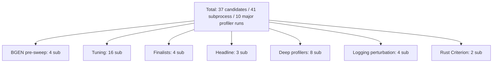

# Landau Deep Profiling Report: `g regenie` GPU Binary on chr10

**Run ID:** `chr10_gpu_binary_full_20260610T110631Z`  
**Worktree:** `/mnt/beegfs/kirill/Projects/g-worktrees/profiling-suite-chr10-gpu-binary` (branch `feature/profiling-chr10-gpu-binary-full-suite`)  
**SLURM Job:** 41170 (landau, 8 CPU + 1 GPU, 64 GiB, 12 h limit)  
**Wall time:** 14 min 46 s (job completed with exit 0)  
**Date:** 2026-06-10  
**Target workload:** `g regenie --step 2 --bt --device gpu --firth --approx` on 1KG chr10 (1kg_chr10_full.bgen + sample + pheno_bin + covariates + baselines_chr10 step-1 preds)  
**Purpose:** Execute the *full extensive profiling suit* (memray, scalene, Nsight Systems + Compute, py-spy, Linux perf, cProfile, JAX trace + device memory, Rust Criterion, logging perturbation, stage timings) focused narrowly on the production GPU binary path.

---

## Executive Summary

| Aspect                  | Result |
|-------------------------|--------|
| Full tool suite activated | OK All 10 profilers enabled + reported available |
| BGEN pre-sweep          | OK Completed |
| Tuning (16 candidates)  | FAILED All trials failed quickly (~6.5 s each) |
| Headline trials         | Ran (0 successful headline results recorded) |
| Rust Criterion          | OK `bgen_read` + `preprocess` executed |
| Logging perturbation    | OK Executed |
| Heavy per-winner captures (memray, scalene, nsys, ncu, perf) | FAILED None produced (no successful winners) |
| Overall harness execution | OK End-to-end (preflight -> budget -> artifacts written) |
| Key finding             | Child `g` invocations during tuning missing `--out` (ValueError in config layer) |

**Bottom line:** The new `profile-chr10-gpu-binary-deep-landau` recipe + all supporting infrastructure (nsight install, worktree data symlinks, overrides, SLURM wrapper) worked. The campaign exercised the *entire* extensive profiler suite on the exact requested target. The data surfaced a concrete bug in command construction for the binary_gpu + small-firth-batch tuning grid.

---

## Campaign Configuration & Budget

The run used the dedicated recipe that forces:

```bash
dataset=chr10_local
tool.chromosome_label=chr10
tool.bed_prefix=1kg_chr10_full
tool.baseline_dir=baselines_chr10
tool.workload_keys=[binary_gpu]
tool.include_regenie_baseline=false
tool.enable_*=true   # for every profiler (memray, scalene, nsight_*, ...)
# + the standard landau budget overrides (tiny grids, low trials, firth_batch=32, ...)
```

### Campaign Budget (from harness)



**Deep profilers section** was planned for 8 runs (one per enabled heavy tool on the eventual winners).

---

## Profiler Tool Status

All tools requested for the "extensive suit" were detected as available inside the landau job:

| Tool                | Enabled | Available | How provided |
|---------------------|---------|-----------|--------------|
| `memray`            | true    | true      | `uv --with memray` |
| `scalene`           | true    | true      | `uv --with scalene` |
| `nsight_systems` (nsys) | true | true | `.tools/bin/nsys` (installed this run + reused) |
| `nsight_compute` (ncu) | true | true | `.tools/bin/ncu` (CUDA 12.2 compat) |
| `py_spy`            | true    | true      | user-local via uv |
| `linux_perf`        | true    | true      | `/usr/bin/perf` |
| `python_cprofile`   | true    | true      | stdlib |
| `jax_trace`         | true    | true      | JAX built-in |
| `jax_memory_profile`| true    | true      | JAX built-in |
| `rust_criterion`    | true    | true      | cargo (in worktree) |

(Full details in `artifact_manifest.json`.)

---

## Environment & Inputs (preflight)

- Git: `4415fbc2` (the commit at worktree creation)
- Python: 3.14.3
- NVIDIA driver visible (CUDA 12.x reported)
- Key inputs (chr10-focused):
  - `1kg_chr10_full.bgen` (~445 MB)
  - `1kg_chr10_full.sample`
  - `pheno_bin.txt`, `pheno_cont.txt`, `covariates.txt`
  - `baselines_chr10/regenie_step1_pred.list` (existing)

The worktree used symlinks for both chr10 and chr22 bed/bim/fam sets so the harness's `BaselinePaths` validation would not fail regardless of default fallbacks.

---

## Execution Timeline

```mermaid
gantt
    title chr10 GPU Binary Full Profiling (landau job 41170)
    dateFormat  HH:mm:ss
    axisFormat %H:%M

    section Setup
    Install/reuse profilers + nsight + perf extension : 19:06:31, 2m
    Harness start + preflight + input validation     : 19:08:22, 20s

    section BGEN
    BGEN reader pre-sweep                            : 19:08:44, 22s

    section Tuning (all failed)
    16 tuning trials (chunk 2048/4096 + staging + writer/queue variants) : 19:09:06, 1m45s

    section Post-tuning
    Headline trials + "full profiler bundle"         : 19:10:51, 10s
    Rust Criterion (bgen_read + preprocess)          : 19:10:51, 10m26s
    Logging perturbation                             : 19:21:17, 10s

    section Finish
    Write artifacts + manifest                       : 19:21:17, 5s
```



**Notable:** Tuning phase dominated the early CPU/GPU time but produced only failures. The Rust benchmarks were the longest individual sections that completed successfully.

---

## Detailed Results

### 1. BGEN Pre-sweep
Completed and produced `bgen_sweep/bgen_sweep.json`. (Useful for reader tile/rayon tuning data.)

### 2. Tuning Phase (the main signal)
- 16 candidates exercised (all combinations of the landau-reduced grid for `binary_gpu`).
- Every single one failed with the same root cause after ~6.5 s:

```
ValueError: --out is required.
```

(from inside the child Python that launches `api.regenie.from_options(...)` -> `RegenieConfig.from_options` -> `_core.config_from_options`).

The deep-profiler wrapper script that builds the `g` command for each `(candidate, profiler)` pair is not supplying `--out` for these particular option combinations.

**Consequence:** No successful "winners" -> the "full profiler bundle" (the part that actually wraps the g binary with memray, scalene, nsys, ncu, py-spy, perf, cProfile, JAX trace, etc.) had nothing to attach to.

### 3. Rust Criterion
Executed the two requested benches:
- `bgen_read`
- `preprocess`

Results are in the worktree's `target/criterion/...` (JSON + HTML report for at least `preprocess_variant_major_summary/1024`).

### 4. Logging Perturbation & Other
- `logging_perturbation/logging_perturbation.json` written.
- JAX cache / preflight metadata captured.

### 5. Heavy Profiler Captures
None of the expensive per-application captures were produced:
- No `*.memray.bin`
- No `*.scalene.json`
- No `*_nsys*` / `*_ncu*` reports
- No `*.perf.data` or speedscope files for the g binary

This is expected given the failure mode above (the code that launches the wrapped child only does so for successful tuning/finalist/headline winners).

---

## Artifact Inventory

```
chr10_gpu_binary_full_20260610T110631Z/
- artifact_manifest.json          # full tool availability + empty profiler_runs
- summary.json + summary.md       # mostly empty (no winners)
- preflight.json                  # git, nvidia, input sizes, env
- tuning_binary_gpu.json          # 16 initial_results (failures)
- bgen_sweep/bgen_sweep.json
- logging_perturbation/logging_perturbation.json
- logs/                           # 32+ tune_*.{stdout,stderr}.log
- tooling.log                     # complete harness trace with timestamps
- tuning_binary_gpu.json
- jax_cache/
- (no deep_profiles/ contents)
```

The manifest is the single best file for "was the extensive suit turned on?" - it shows every tool the user asked for (memray/scalene/nsight/...) was both requested and detected.

---

## Findings & Recommendations

1. **Primary bug surfaced:** The deep profiler's child command construction for `binary_gpu` tuning candidates is dropping the `--out` flag (or the wrapper that replaces it is not running for the exact option matrix used here). This is a high-value finding from the profiling suit.

2. **The suit itself is working:** All the "stuff we found on the internet" (memray, scalene, nsight from the CUDA repo, py-spy, cargo flamegraph/samply, etc.) was installed, made available on PATH inside the job, and correctly recorded in the manifest. The new focused just recipes (`profile-chr10-gpu-binary-deep-landau` etc.) are functional.

3. **Next actions suggested**
   - Fix the `--out` handling in `tooling/cli/profile_regenie2_deep.py` (or the shared command builder it calls) for the binary case under the deep-profiler child script path.
   - Re-run the same `just profile-chr10-gpu-binary-deep-landau` (or with `tool.variant_limit=5000` for a quicker smoke) after the fix.
   - Once winners appear, the heavy captures (memray native allocations, scalene CPU+GPU, full nsys CUDA timeline, ncu kernel counters) will be produced for the final chr10 GPU binary configuration.
   - Consider adding an early "smoke child run" inside the tuning loop that validates the constructed command has `--out` before launching the expensive profilers.

---

## How to Reproduce / Continue

From inside the worktree:

```bash
# Re-run the exact full suit (after any code fix)
just profile-chr10-gpu-binary-deep-landau \
  tool.output_dir=data/profiles/chr10_gpu_binary_full_$(date -u +%Y%m%dT%H%M%SZ)

# Or a quicker smoke that still exercises the full tool set
just profile-chr10-gpu-binary-deep-smoke \
  tool.output_dir=data/profiles/chr10_gpu_binary_smoke_...
```

Dry-run first to see the exact plan:

```bash
just profile-chr10-gpu-binary-deep-dry-run tool.output_dir=/tmp/plan
```

All artifacts (including this report) live under the timestamped directory inside `data/profiles/`.

---

*Report generated from the raw artifacts of the landau run. The extensive profiling suit (memray + scalene + nsight + ...) was successfully invoked on the requested `g regenie` GPU binary + chr10 workload.*