# Phase 14 Current Architecture

Snapshot from the `phase14-runner-timing-ownership` worktree. This reflects the
current Phase 14 ownership boundary: Rust owns typed host policy and lifecycle
handles, while Python still carries the transitional runner/pipeline/JAX callback
bridge.

```mermaid
flowchart TB
    classDef rust fill:#e8f3ff,stroke:#1f6feb,color:#061b33
    classDef crate fill:#edf8ee,stroke:#22863a,color:#061b0b
    classDef python fill:#fff7e6,stroke:#c77700,color:#2b1a00
    classDef jax fill:#f3e8ff,stroke:#8250df,color:#211033
    classDef transitional fill:#fff0f0,stroke:#d1242f,color:#3b0a0a
    classDef removed fill:#f6f8fa,stroke:#6a737d,color:#24292f,stroke-dasharray:4 3
    classDef data fill:#ffffff,stroke:#6a737d,color:#24292f

    CLI["CLI user"]:::data
    PY["Python API user"]:::data
    INPUT["BGEN/sample/pheno/covariates/LOCO"]:::data
    OUTPUT["Parquet/REGENIE/manifests/timing/telemetry"]:::data

    subgraph RustWorkspace["Rust workspace: target owner"]
        GCLI["g-cli<br/>native frontend, help, parse, TOML bridge"]:::crate
        GInterface["g-interface<br/>defaults, overlays, validation, RunRequest"]:::crate
        GPlan["g-plan<br/>RunRequest, PreparedRunPlan, host planning contracts"]:::crate
        GGenotype["g-genotype<br/>BGEN mmap/index/decode/chunk planning"]:::crate
        GInput["g-input<br/>sample alignment, prediction/LOCO loading"]:::crate
        GOutput["g-output<br/>writer sessions, manifests, resume, finalization"]:::crate
        GRuntime["g-runtime<br/>logging, telemetry, timing, shutdown, JAX policy"]:::crate
        GEngine["g-engine<br/>preflight, scheduler policy, queues, callback resources, coordinator scaffold"]:::crate
    end

    subgraph RootPyO3["Root Rust crate: g / _core"]
        Core["src/lib.rs + src/python/mod.rs<br/>PyO3 registration only"]:::rust
        CoreConfig["config bindings"]:::rust
        CoreRuntime["runtime state, JAX setup sessions, compatibility tokens"]:::rust
        CoreEvents["run events, telemetry, diagnostics, final timing"]:::rust
        CoreEngine["Regenie2RunEngine, BGEN delivery, genotype handles"]:::rust
        CoreInput["sample alignment + prediction source handles"]:::rust
        CoreOutput["output lifecycle, writer session, manifest handles"]:::rust
        CoreSchedule["NativeSchedulePolicy, callback scheduler state"]:::rust
        CoreCallbacks["NativeCallbackRuntimeResources, queues, progress, binary summary"]:::rust
        CorePreflight["NativePreflightValidator"]:::rust
    end

    subgraph KeptPython["Python kept surface"]
        API["g.api<br/>public convenience API"]:::python
        ConfigPy["g.interface.config<br/>thin native config adapter"]:::python
        JaxRuntime["g.jax_runtime<br/>Python-required JAX setup adapter"]:::jax
        Compute["g.compute.*<br/>JAX linear/binary kernels"]:::jax
    end

    subgraph TransitionalPython["Phase 14 transitional Python orchestration"]
        Runner["g.runner.*<br/>run glue, events, lifecycle, timing, output metadata"]:::transitional
        ExecPlan["g.execution_plan<br/>typed Python adapter over native run request"]:::transitional
        Pipeline["g.engine.regenie2_pipeline.*<br/>single/multi/group pipeline branching"]:::transitional
        NativeDispatch["g.engine.native_dispatch.*<br/>BGEN/open/delivery/writer adapter layer"]:::transitional
        CallbackRuntime["g.engine.callbacks.runtime<br/>base callback bridge over native resources"]:::transitional
        CallbackWriters["g.engine.callbacks.writers<br/>JAX result materialization + native writer calls"]:::transitional
        CallbackTransfers["g.engine.callbacks.transfers<br/>device/host transfer timing helpers"]:::transitional
        CallbackDiag["g.engine.callbacks.diagnostics<br/>binary diagnostics + host materialization"]:::transitional
        CallbackTraits["callbacks.linear/binary/grouped<br/>JAX backend callback implementations"]:::transitional
    end

    subgraph RemovedGuarded["Removed or guarded Python ownership"]
        IO["g.io / g.io.output removed"]:::removed
        EngineTelemetry["g.engine.telemetry removed"]:::removed
        EngineEvents["g.engine.run_events removed"]:::removed
        EngineShutdown["g.engine.shutdown removed"]:::removed
        EngineTiming["g.engine.timing removed"]:::removed
        EnginePreflight["g.engine.preflight removed"]:::removed
        LocalShims["callback/pipeline/native-dispatch timing/event/lifecycle shims removed"]:::removed
        Fallbacks["Python fallback helpers guarded by architecture checks"]:::removed
    end

    CLI --> GCLI
    GCLI --> GInterface
    GInterface --> GPlan
    GCLI --> Core
    CLI --> API
    PY --> API

    API --> ConfigPy
    API --> Runner
    ConfigPy --> CoreConfig
    Runner --> ExecPlan
    Runner --> JaxRuntime
    Runner --> Pipeline
    Runner --> CoreRuntime
    Runner --> CoreEvents
    Runner --> CoreOutput

    ExecPlan --> CoreConfig
    ExecPlan --> GPlan

    Pipeline --> NativeDispatch
    Pipeline --> CoreInput
    Pipeline --> CorePreflight
    Pipeline --> CoreOutput
    Pipeline --> CoreSchedule
    Pipeline --> CallbackTraits

    NativeDispatch --> CoreEngine
    NativeDispatch --> CoreOutput
    NativeDispatch --> CoreEvents

    CallbackTraits --> CallbackRuntime
    CallbackTraits --> CallbackWriters
    CallbackTraits --> CallbackTransfers
    CallbackTraits --> CallbackDiag
    CallbackTraits --> Compute

    CallbackRuntime --> CoreCallbacks
    CallbackRuntime --> CoreSchedule
    CallbackWriters --> CoreOutput
    CallbackWriters --> CallbackTransfers
    CallbackTransfers --> CoreEvents
    CallbackDiag --> CoreCallbacks

    JaxRuntime --> CoreRuntime
    Compute --> JaxRuntime

    CoreConfig --> GInterface
    CoreConfig --> GPlan
    CoreRuntime --> GRuntime
    CoreEvents --> GRuntime
    CoreEngine --> GEngine
    CoreEngine --> GGenotype
    CoreInput --> GInput
    CoreOutput --> GOutput
    CoreSchedule --> GEngine
    CoreCallbacks --> GEngine
    CorePreflight --> GEngine

    GEngine --> GGenotype
    GEngine --> GOutput
    GOutput --> GPlan

    INPUT --> GGenotype
    INPUT --> GInput
    GOutput --> OUTPUT
    GRuntime --> OUTPUT
```

## Notes

- Rust owns typed host policy and lifecycle contracts through internal crates
  and root PyO3 handles.
- Root `_core` is the Python binding/composition boundary.
- Python still owns public convenience APIs, JAX runtime setup that must happen
  in Python, JAX kernels, and transitional run/pipeline/callback glue.
- Removed Python ownership modules are guarded by architecture checks so stale
  fallbacks do not silently return.
